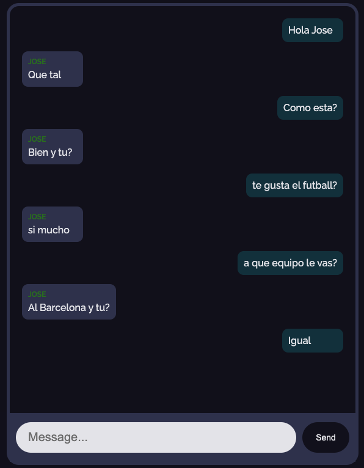

[![MIT License][license-shield]][license-url]
[![LinkedIn][linkedin-shield]][linkedin-url]

 

  <h1 align="center">Chat App</h1>

  

    Projecto creado por:   <strong> Jose Luis Chavez Guerra </strong>
     
    <a href="https://chat-app-mauve.vercel.app/"><strong>Ver Pagina »</strong></a>
     
     
    ·
    <a href="https://github.com/guerracode/ChatApp/issues">Report Bug</a>
    ·
    <a href="https://github.com/guerracode/ChatApp/issues">Request Feature</a>
  

<!-- ABOUT THE PROJECT -->

## Sobre el proyecto

Chat en tiempo real tipo WhatsApp.  

### Construido con

Estas son las principales tecnologias usadas en el proyecto:

- JavaScript
- Node
- Express
- SocketIO
- React

## Imagen ejemplo del Chat

<!-- GETTING STARTED -->

## Probar el proyecto

Se le hizo deploy al proyecto, por lo tanto se puede probar accediendo a esta [URL](https://chat-app-mauve.vercel.app/). 

### Correr en Local

- Descargar o clonar el proyecto.
- Abrir dos terminales una para el cliente y otra para el server.
- En cada uno instalar las dependencias con: 
  `npm install`
- Correr el proyecto en las dos teminales, **cliente** y **server** con:   `npm run start`
- Con ello tendras corriendo el servidor y el cliente te abrira la pagina en el navegador.

### Usar el chat

- Ingresar **Name**
- Ingresar el **Room** (puede ser cualquiera)
- Abrir otra pestaña del navegador con la misma URL.
- Ingresar otro nombre y el mismo **Room** ya antes puesto para poder chatear entre si.  

Con eso podran chatear en tiempo real entre las dos pestañas e incluso pueden abrir una instancia desde cualquier computadora e ingresando el mismo **Room** podran chatear entre si.

<!-- CONTRIBUTING -->
 
 
 

## Contributing

Contributions are what make the open source community such an amazing place to be learn, inspire, and create. Any contributions you make are **greatly appreciated**.

1. Fork the Project
2. Create your Feature Branch (`git checkout -b feature/AmazingFeature`)
3. Commit your Changes (`git commit -m 'Add some AmazingFeature'`)
4. Push to the Branch (`git push origin feature/AmazingFeature`)
5. Open a Pull Request

## Contact

Jose Luis Chavez - [@guerracode](https://twitter.com/guerracode) - josephsiul15@gmail.com

Project Link: [GitHub](https://github.com/guerracode/ChatApp)

<!-- LINKS -->

[license-shield]: https://img.shields.io/github/license/othneildrew/Best-README-Template.svg?style=flat-square
[license-url]: https://github.com/guerracode/To-Do/blob/master/LICENSE
[linkedin-shield]: https://img.shields.io/badge/-LinkedIn-black.svg?style=flat-square&logo=linkedin&colorB=555
[linkedin-url]: https://www.linkedin.com/in/jose-luis-chavez/
